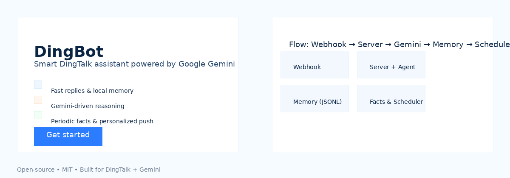
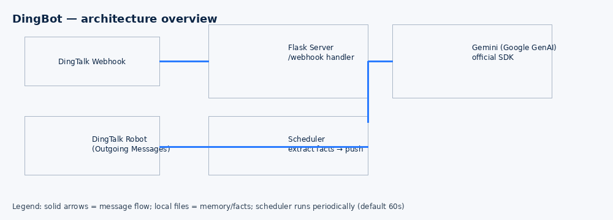

# DingHook

[](https://pypi.org/)
[](LICENSE)

A simple DingTalk chatbot service that integrates with Google Gemini (via the official `google-genai` SDK) for conversational replies, keeps lightweight local memory (JSONL), and periodically extracts facts to generate personalized push messages.





## Key features

- Webhook receiver to accept DingTalk messages and commands (/help, /remember, /memories, /ping)
- Gemini-driven analysis and replies using the official `google-genai` SDK
- Local message memory stored as JSONL for auditability and lightweight persistence
- Periodic fact extraction and push messages (scheduler default: every 60 seconds)
- Safe defaults (no REST fallback for Gemini; requires SDK + API key)

## Quick Start

1. Install dependencies:

```bash
pip install -r dingbot/requirements.txt
```

2. Start the server with a single-line example (set PORT and env in one line):

```bash
PORT=8090 GEMINI_API_KEY=your_key_here ACCESS_TOKEN=your_dingtalk_access_token SECRET='your secret with spaces' \
  python -u -m dingbot.server
```

Notes:
- Use `-u` to disable Python buffering for real-time logs.
- Keep secrets out of your repo; prefer using environment variable management in CI or a secrets manager.

4. Health check:

```bash
curl http://127.0.0.1:8080/
```

5. Send a test message (returns plain text reply):

```bash
curl -s -X POST http://127.0.0.1:8080/webhook \
  -H 'Content-Type: application/json' \
  -d '{"msgtype":"text","text":{"content":"Tell me a joke"},"senderNick":"Tester","senderId":"tester-1"}'
```

## Configuration

- `MEMORY_FILE` — path to JSONL memory (default: `dingbot_memory.jsonl`)
- `FACTS_FILE` — path to fact file (default: `dingbot_fact.json`)
- `CHECK_INTERVAL_SECONDS` — scheduler interval in seconds (default: `60`)
- `GEMINI_MODEL` — model name (default: `models/gemini-3-pro-preview`)

## Development

- Run unit tests:

```bash
env PYTHONPATH=. pytest -q
```

## Security

- Do NOT commit secrets to the repository (API keys, access tokens, or secrets). If a secret is accidentally committed:
  - Revoke/rotate the key immediately.
  - Remove it from history using a tool like `git filter-repo`.

## Contributing

Contributions welcome — please open an issue first to discuss major changes.

## License

MIT © You
